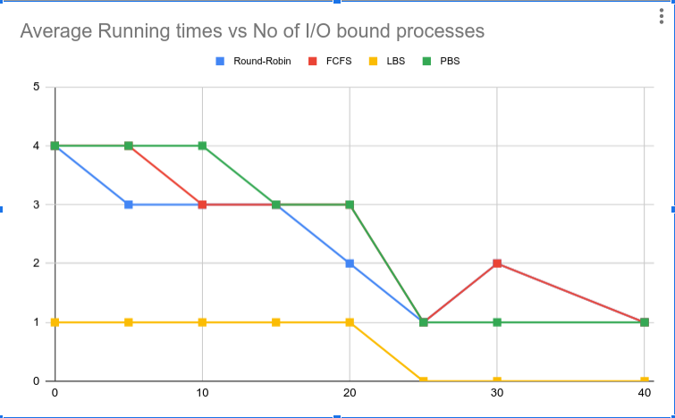

## Contens

- [Scheduling](#scheduling)
- [Strace](#strace)
- [Sigalarm and Sigreturn](#sigalarm-and-sigreturn)
- [Copy on Write Fork](#copy-on-write-fork)
- [Stats](#stats)


# Scheduling
Each Scheduling Algorithm is given a Definitive TAG as follows:
```cpp
    FCFS - First Come First Serve
    RR - Round Robin
    PBS - Priority Based Scheduling
    LBS - Lottery Based Scheduling
```

The Scheduling Algorithm that is to be used must be mentioned in the tags as follows
```bash
    $ make qemu SCHEDULER=<TAG>
```

Note that if multiple Scheduling algorithms are tested in succession, the object files in the folders correspond to the previous Scheduling algorithm TAG, hence we wish to get rid of these tags. We do so by running
```bash
    $ make clean
```

# Types

## i) First-Come First-Serve Scheduler
A scheduling policy that selects the process with the lowest creation time

## ii) Lottery Based Scheduler
Implement a preemptive scheduler that assigns a time slice to the process randomly in proportion to the number of tickets it owns.

## iii) Priority Based Scheduler
The processes are prioritised and provided the time slice according to this priority function.


## iv) Multi-Level Feedback Queue Scheduling
Separate processes into multiple ready queues based on their need for the processor.\
\
Give preference to processes with short CPU bursts\
Give preference to processes with high I/O burst


# Copy on Write Fork
Copy-on-Write Fork is a Virtual memory management modification which can be applied in kernels.

The goal of copy-on-write (COW) fork() is to defer allocating and copying physical memory pages for the child until the copies are actually needed, if ever. 
COW fork() creates just a pagetable for the child, with PTEs for user memory pointing to the parent's physical pages. 

COW fork() marks all the user PTEs in both parent and child as not writable(remove write prmissions). 

When either process tries to write one of these COW pages, the CPU will force a page fault. The kernel `pagefaulthandler` in `kernel/trap.c` detects this case, allocates a page of physical memory for the faulting process, copies the original page into the new page, and modifies the relevant PTE in the faulting process to refer to the new page, this time with the PTE marked writeable. 

When the page fault handler returns, the user process will be able to write its copy of the page.

Note that a given physical page may be referred to by multiple processes' page tables, and should be freed only when the last reference disappears, so in order to handle this, we can create a struct `ref_count` which has a `spinlock` and an array of number of pages in each page to record this.(acts as a Semaphore)

# Strace
s-trace command is of the form :

>                    strace mask command <arguments>

 - mask here is an integer, whose bits specify which system calls to trace
 - in order to trace `ith` system call, a program calls strace `1 << i`, where i is  the system call number

Output of strace is in the following form :

>                    "pid of process" : syscall "name_of_syscall" ([decimal value of arguments in registers])-> "return value"


## Sigalarm and Sigreturn
In this specification, we added a feature to xv6 that periodically alerted a process as it uses CPU time. Each clock cycle of the Hardware clovk is taken as a `tick`.
We implemented a new `sigalarm(interval,handler)` system call, and also `sigreturn()` system call.
If an application calls `alarm(n,fn)`, then after every n ticks of CPU time that the program consumes, the kernel will cause application function `fn` to be called. When `fn` returns, the application picks up where it left off.
- `alarm(n,fn)` is a user defined function, in `alarmtest.c`

Sigreturn restores the trapframe of the process before `handler` was called.

# Stats

Using the `scheduler.c` I created 100 processes which forked, of which , N were I/O Bound processes.
Every I/O bound Process sleeps for 200 ms, whereas every CPU bound process executes the following.
```cpp
  for (int i = 0; i < 1000000000; i++) {}; // CPU bound process
```
I also edited the `scheduler.c` file to set tickets for `LBS`.
The number of tickets that are added to every process is `i%3+1` tickets where `i` is the inherent Process number.

I then calculated the Average Running times,Waiting times of the processes, and tabulated them into graphs.

## Comparing Average Running times of processes in different Scheduling Algorithms



As Expected, We see that in all scheduling algorithms, the average running time of processes are decreasing, since the processes are waiting in the I/O queue for most of the time.

We also see that the Smarter, Priority based Scheduling performs better than it's Counterparts. This is because it priotitises processes over others, hence giving other processes time to also run.
>Note that these values are rounded down to the nearest integer 

## Comparing Average Waiting times of processes in different Scheduling Algorithms


As Expected, We see that in all scheduling algorithms, the average waiting time of processes are increasing, since the processes are waiting in the I/O queue for most of the time.

We also see that in this case, FCFS and PBS performed similarly, and had lower waiting times than RR Scheduling.
We can infer from this data that FCFS is better with shorter CPU burst periods, that is to say, more I/O bound processes. This corresponds with the theory that FCFS scheduling tends to penalise short processes.

In both cases we see that LBS scheduling performed poorly, and RR scheduling performed average on deafult xv6 settings for the time quanta.

For 100 process, if number of I/O bound processes are 20, then the following are the avg_runtime and avg_waittime for each process

RR : 
  - Average Running time : 2
  - Average Waiting time : 74

LBS :
  - Average Running time : 1
  - Average Waiting time : 70

FCFS : 
  - Average Running time : 3
  - Average Waiting time : 59 

PBS :
  - Average Running time : 3
  - Average Waiting time : 59 
